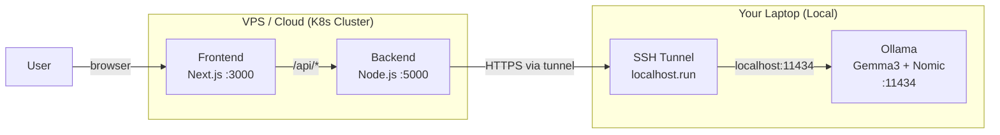

# 🚀 Deployment Guide: VPS (Docker/K8s) + Local Ollama Inference

## Architecture



> **Key Idea:** Backend & Frontend run on VPS. LLM inference (Gemma3 + Nomic embeddings) runs on your laptop. They communicate via an SSH tunnel.

---

## Step-by-Step

### 1. On Your Laptop: Start Ollama + Tunnel

Open **two terminals**:

**Terminal 1** — Start Ollama listening on all interfaces:
```powershell
$env:OLLAMA_HOST="0.0.0.0"
ollama serve
```

**Terminal 2** — Open the SSH tunnel:
```bash
ssh -R 80:localhost:11434 ssh.localhost.run
```

You will get a URL like `https://xxxxxxxx.lhr.life`. **Copy this URL** — you'll need it for the next step.

> [!IMPORTANT]
> Both terminals must stay open. If you close them, the VPS loses connectivity to your laptop's Ollama.

---

### 2. On VPS: Update Secrets with the Tunnel URL

SSH into your VPS, then run:

```bash
export OLLAMA_TUNNEL_URL="https://xxxxxxxx.lhr.life"   # ← paste your tunnel URL
export GITHUB_TOKEN="github_pat_..."
export GEMINI_API_KEY="AIza..."
export DATABASE_URL="postgresql://..."
export JWT_SECRET="your-jwt-secret"

bash k8s/create-secrets.sh
```

Or manually create the secret:
```bash
kubectl delete secret specai-backend-secrets -n codecatalyst --ignore-not-found
kubectl create secret generic specai-backend-secrets \
  --namespace=codecatalyst \
  --from-literal=DATABASE_URL="$DATABASE_URL" \
  --from-literal=JWT_SECRET="$JWT_SECRET" \
  --from-literal=OLLAMA_BASE_URL="$OLLAMA_TUNNEL_URL" \
  --from-literal=GITHUB_TOKEN="$GITHUB_TOKEN" \
  --from-literal=GEMINI_API_KEY="$GEMINI_API_KEY"
```

---

### 3. Build & Push Docker Images

From your project root (on your laptop or CI):

```bash
# Backend
docker build -f docker/backend.Dockerfile -t beetle1110/specai-backend:v5 backend/
docker push beetle1110/specai-backend:v5

# Frontend
docker build -f docker/frontend.Dockerfile -t beetle1110/specai-frontend:v4 frontend/
docker push beetle1110/specai-frontend:v4
```

> [!TIP]
> Update the image tag in `k8s/backend-deployment.yaml` and `k8s/frontend-deployment.yaml` to match the version you just pushed.

---

### 4. Deploy to Kubernetes

```bash
export KUBECONFIG=k8s/kubeconfig.yaml

kubectl apply -f k8s/backend-deployment.yaml
kubectl apply -f k8s/backend-service.yaml
kubectl apply -f k8s/frontend-deployment.yaml
kubectl apply -f k8s/frontend-service.yaml
kubectl apply -f k8s/ingress.yaml

# Verify pods are running
kubectl get pods -n codecatalyst
```

> [!NOTE]
> You do **NOT** need to deploy `ollama-deployment.yaml` or `ollama-service.yaml` anymore since Ollama runs on your laptop.

---

### 5. When the Tunnel URL Changes

Every time you restart the SSH tunnel, you get a new URL. Update the secret:

```bash
export OLLAMA_TUNNEL_URL="https://NEW-URL.lhr.life"
kubectl delete secret specai-backend-secrets -n codecatalyst --ignore-not-found
kubectl create secret generic specai-backend-secrets \
  --namespace=codecatalyst \
  --from-literal=DATABASE_URL="$DATABASE_URL" \
  --from-literal=JWT_SECRET="$JWT_SECRET" \
  --from-literal=OLLAMA_BASE_URL="$OLLAMA_TUNNEL_URL" \
  --from-literal=GITHUB_TOKEN="$GITHUB_TOKEN" \
  --from-literal=GEMINI_API_KEY="$GEMINI_API_KEY"

# Restart the backend pod to pick up the new secret
kubectl rollout restart deployment specai-backend -n codecatalyst
```

---

## Alternative: Docker Compose (Without Kubernetes)

If you prefer Docker Compose on the VPS:

1. Copy the project to VPS
2. Update `backend/.env` with the tunnel URL:
   ```env
   OLLAMA_BASE_URL=https://xxxxxxxx.lhr.life
   ```
3. Run:
   ```bash
   cd docker
   docker compose up -d --build
   ```

---

## Files Changed

| File | Change |
|------|--------|
| `backend/src/services/repoFetcher.ts` | Added noise directory filtering |
| `backend/src/services/llm-service.ts` | Robust JSON parser + fallback keys + strict prompt |
| `k8s/backend-deployment.yaml` | `OLLAMA_BASE_URL` now from Secret (not hardcoded) |
| `k8s/create-secrets.sh` | **New** — helper to create K8s secrets |
| `docker/docker-compose.yaml` | **New** — compose file for VPS without in-cluster Ollama |
